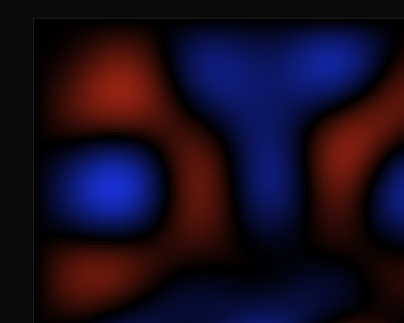

# Laplacian Fluid Sonification

Real-time 2D fluid simulation with bidirectional eigenmode↔frequency sonification, running in the browser.



## Concept

Laplacian eigenfunctions form a natural basis for incompressible fluid flow on a bounded domain. Each eigenmode (k₁,k₂) has a spatial frequency λ = k₁² + k₂² that maps directly to an audible frequency—the correspondence is physically natural, not arbitrary.

The system is **bidirectional**:
- **Fluid→Sound**: The simulation evolves eigenmode coefficients `w`, which drive an oscillator bank
- **Sound→Fluid**: Composed frequencies set `w` directly, visualizing the corresponding flow pattern

The `w` vector is the universal state. Simulation, visualization, and sonification all read/write it.

### Theory

Based on De Witt et al., "Fluid Simulation Using Laplacian Eigenfunctions" and the sonification system from Aaron Demby Jones's dissertation "Seeing and Hearing Fluid Subspaces" (UCSB 2017).

**Simulation loop** (per timestep):
1. Advect via structure tensor: `wDot[k] = w · (C_k · w)` (O(rank³) quadratic form)
2. Euler integration: `w += dt · wDot`
3. Energy correction: rescale to preserve initial enstrophy
4. Viscous diffusion: `w[k] *= exp(λ_k · dt · ν)`
5. Reconstruct velocity: `v = U · w`

**Frequency mapping** (from dissertation):
```
f_k = fundamental · (λ_max / λ_k)^(1/s)
```
where `s` controls octave spread. Amplitudes are L1-normalized: `a_k = |w_k| / ||w||₁`.

## Quick Start

```bash
npm install
npm run dev       # Open http://localhost:5173
npm test          # 25 tests
npm run build     # Production build (~9KB JS)
```

## Controls

| Key | Action |
|---|---|
| Click canvas | Inject vorticity (also starts audio on first click) |
| Space | Pause / unpause |
| S | Toggle sound |
| M | Switch Simulation / Compose mode |
| R | Reset |
| 1-9 (compose mode) | Directly activate individual eigenmodes |

## Architecture

```
src/
  sim/
    basis.ts       Eigenfunction basis, ij pairs, structure tensor C
    fluid.ts       FluidSim class: step loop, reconstruct, inject, setCoefficients
    basis.test.ts  14 tests: pairs, basis properties, structure tensor
    fluid.test.ts  11 tests: energy conservation, dynamics, reconstruction
  viz/
    renderer.ts    Canvas vorticity colormap (red=CCW, blue=CW)
  audio/
    sonifier.ts    Web Audio oscillator bank, bidirectional freq↔mode mapping
  main.ts          App shell, interaction, main loop
```

### Key design decisions

- **Analytic structure coefficients**: Uses closed-form trig product-to-sum identities instead of numerical integration. The tensor is sparse due to selection rules.
- **Column-major flat arrays**: Velocity basis U and structure tensor C stored as `Float64Array` for cache-friendly access in the inner loop.
- **Energy correction**: Rescales w after advection to prevent numerical energy drift (same as C++ reference).
- **No WebGL (yet)**: Canvas 2D is sufficient at 64×64. WebGL particle advection would be a natural next step for visual richness.

## Configuration

Edit constants at the top of `main.ts`:

| Constant | Default | Description |
|---|---|---|
| `RANK` | 16 | Number of eigenmodes |
| `GRID` | 64 | Simulation grid resolution |
| `SIM_STEPS_PER_FRAME` | 50 | Substeps per render frame |
| `DT` | 0.0001 | Timestep |

Sonifier config in the `Sonifier` constructor:

| Parameter | Default | Description |
|---|---|---|
| `fundamental` | 64 Hz | Base frequency |
| `octaveScale` | 1.75 | Octave spread exponent |
| `masterGain` | 0.3 | Master volume |
